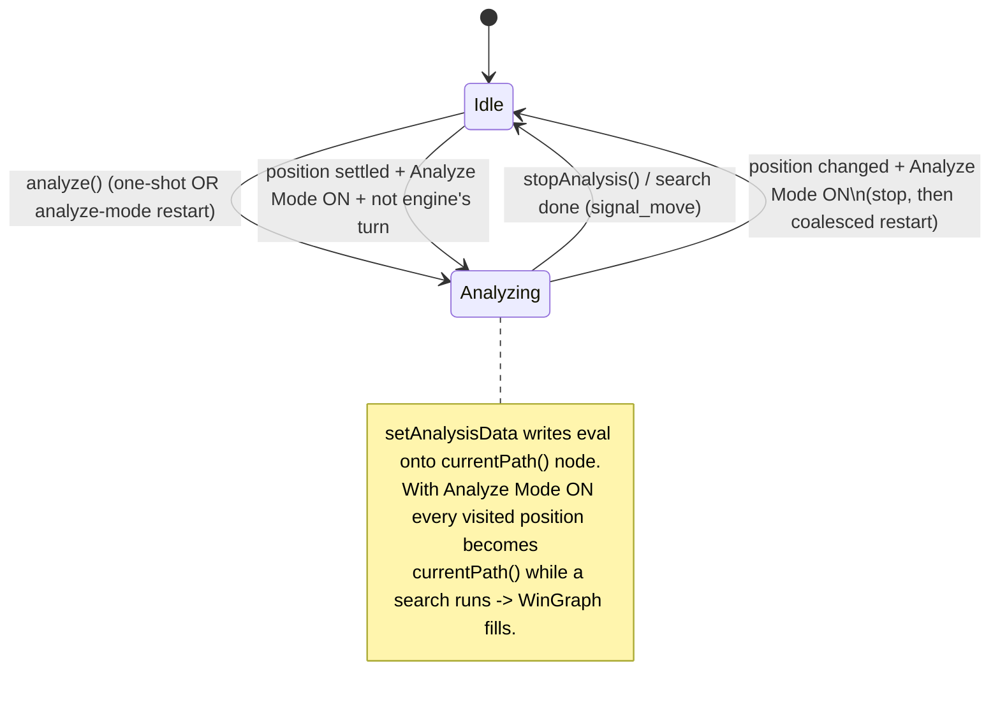
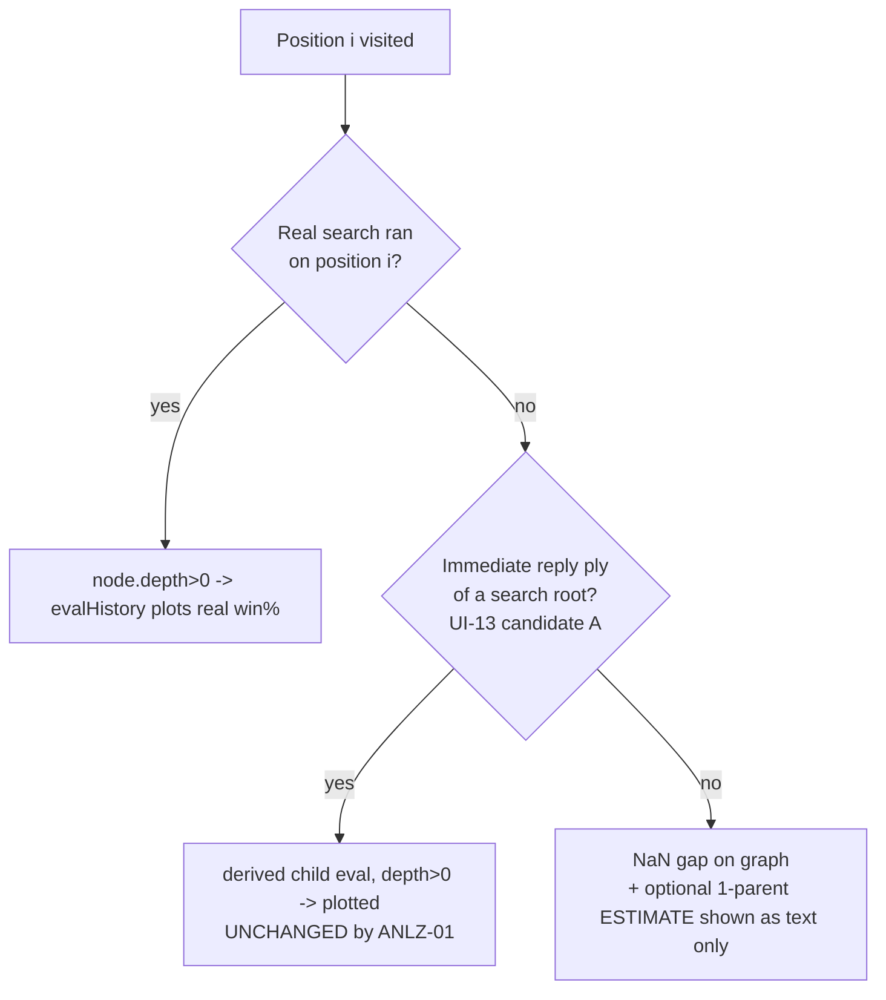

# Analyze Mode — diagrams

See [../user_story.md](../user_story.md) and [../planning.md](../planning.md).

## Engine-controller state with Analyze Mode



## Sequence — user plays a move with Analyze Mode ON

```mermaid
sequenceDiagram
    participant U as User
    participant MW as MainWindow
    participant GS as GameState
    participant EC as EngineController
    participant E as Engine proc

    U->>GS: makeMove(pos)
    GS-->>MW: signal_board_changed
    GS-->>EC: signal_board_changed (clears protocol buffer)
    MW->>MW: scheduleAnalyzeModeRestart()  (autoMoveScheduled_-style coalesce)
    Note over MW: idle callback fires once after the burst settles
    MW->>MW: if Analyze Mode ON && engine Idle:
    alt engine's turn && "Engine plays <side>"
        MW->>EC: requestEngineMove()  (existing auto-move path)
        EC->>E: think
        E-->>EC: signal_move -> board advances
        Note over MW: next board_changed reschedules -> ponder new pos
    else user's turn (or Engine plays Off)
        MW->>EC: stopAnalysis(); analyze()
        EC->>E: STOP + analyze request for new currentPath()
        E-->>EC: info / PV lines
        EC->>GS: setAnalysisData(pvs)  -> currentPath() node eval set
        GS-->>MW: signal_engine_analysis (RT-01 throttled)
        MW->>MW: WinGraphView.setData(...)  -> new real point
    end
```

## Decision — is a derived point ever plotted?


