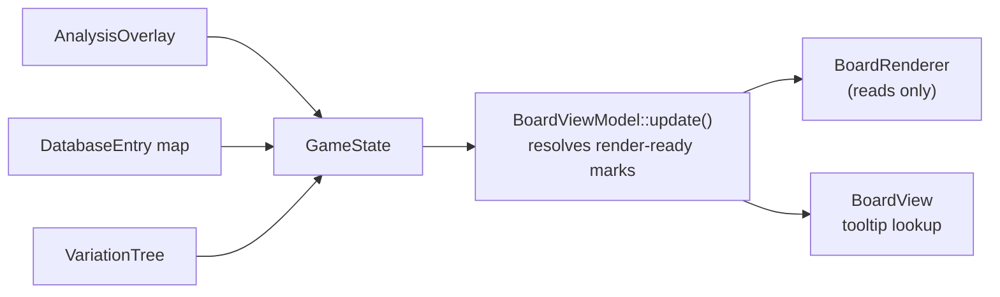
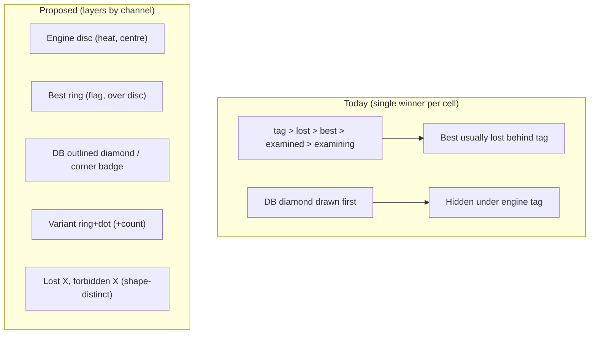
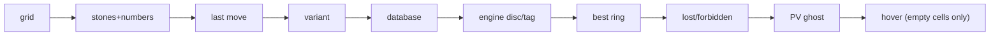

# Board marks — diagrams

See [../user_story.md](../user_story.md) and [../planning.md](../planning.md).

## Data flow (unchanged layering: ui → model)

## Today: one mark per cell vs. proposed: channels that stack

## Z-order (proposed, bottom → top)

