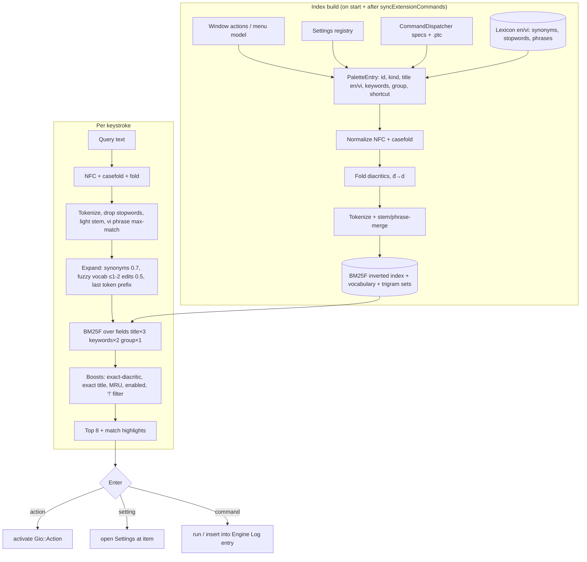

# Command Palette — pipeline

```mermaid
flowchart TD
    subgraph Index["Index build (on start + after syncExtensionCommands)"]
        R1[Window actions / menu model] --> E
        R2[Settings registry] --> E
        R3[CommandDispatcher specs + .ptc] --> E
        L[(Lexicon en/vi: synonyms, stopwords, phrases)] --> E
        E[PaletteEntry: id, kind, title en/vi, keywords, group, shortcut] --> N1[Normalize NFC + casefold]
        N1 --> N2[Fold diacritics, đ→d]
        N2 --> T1[Tokenize + stem/phrase-merge]
        T1 --> IDX[(BM25F inverted index + vocabulary + trigram sets)]
    end
    subgraph Query["Per keystroke"]
        Q[Query text] --> Q1[NFC + casefold + fold]
        Q1 --> Q2[Tokenize, drop stopwords, light stem, vi phrase max-match]
        Q2 --> Q3[Expand: synonyms 0.7, fuzzy vocab ≤1-2 edits 0.5, last token prefix]
        Q3 --> S[BM25F over fields title×3 keywords×2 group×1]
        IDX --> S
        S --> B[Boosts: exact-diacritic, exact title, MRU, enabled, '!' filter]
        B --> OUT[Top 8 + match highlights]
    end
    OUT --> EXEC{Enter}
    EXEC -->|action| A1[activate Gio::Action]
    EXEC -->|setting| A2[open Settings at item]
    EXEC -->|command| A3[run / insert into Engine Log entry]
```
