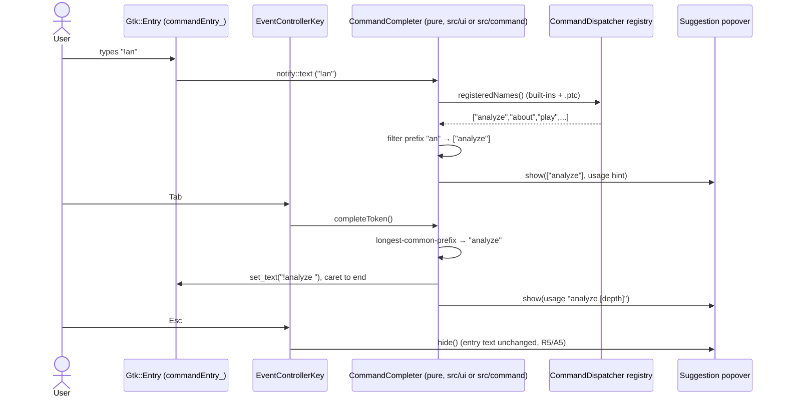
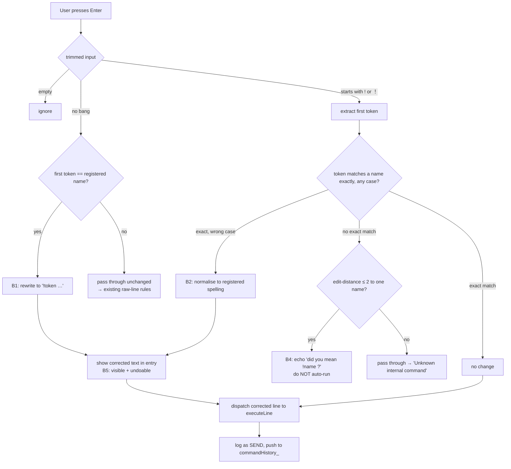
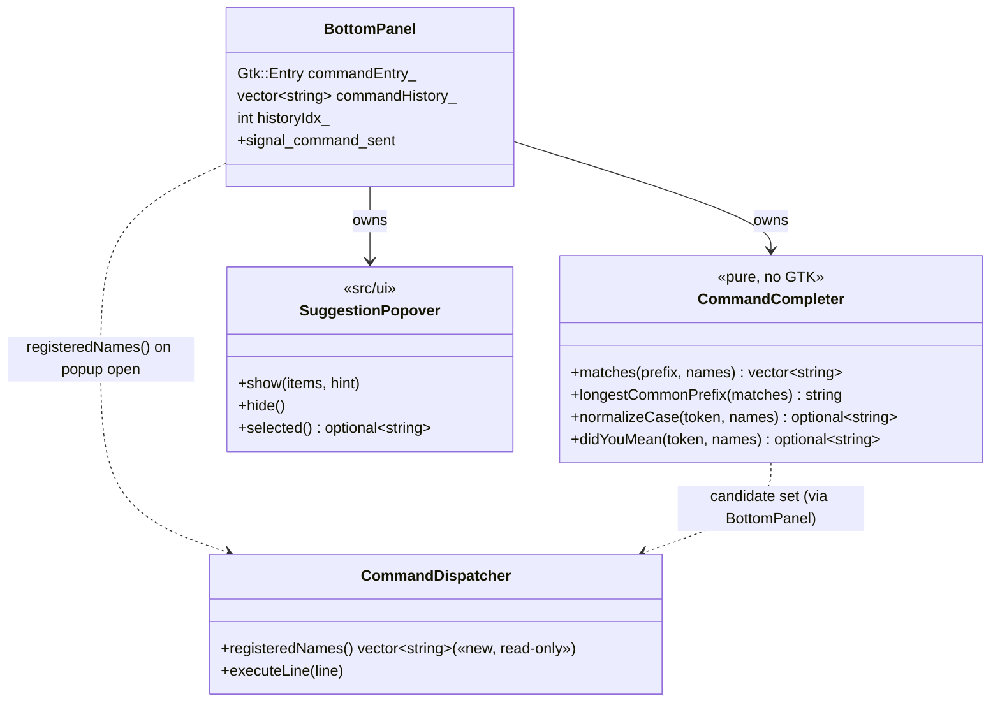

# Console AutoComplete + AutoCorrect — diagrams

Back to [../user_story.md](../user_story.md) · [../planning.md](../planning.md).

## Keystroke → suggestion (Feature A)

## Submit → autocorrect (Feature B)

## Where the new piece sits (component)

