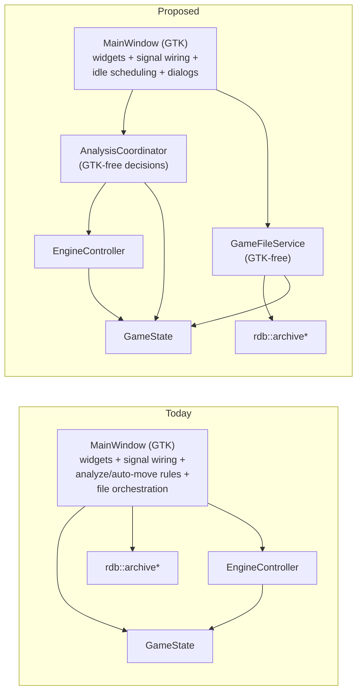
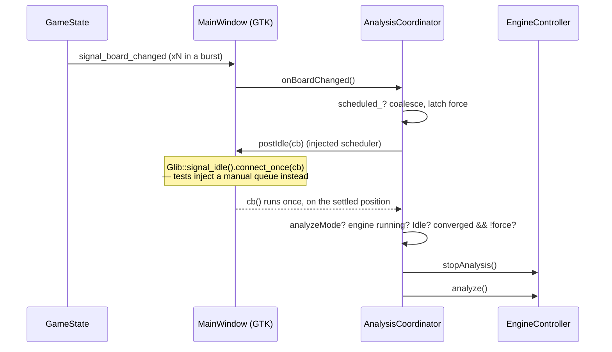

# Extract MainWindow orchestration — diagrams

See [../user_story.md](../user_story.md) and [../planning.md](../planning.md).

## Dependencies today vs. proposed

Arrows point from dependant to dependency; nothing in `AnalysisCoordinator` / `GameFileService` includes
gtk/gtkmm.

## Analyze-restart decision, split across the seam

The coalescing flags, the guard order and the force-latch live in the coordinator; only "run this later"
stays in the widget class.
