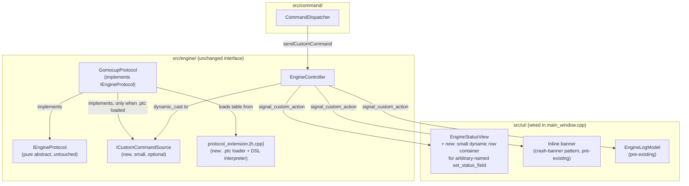
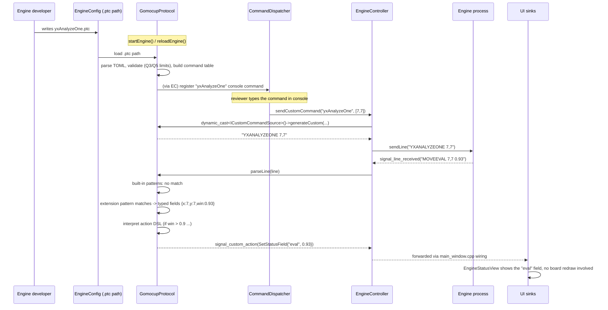
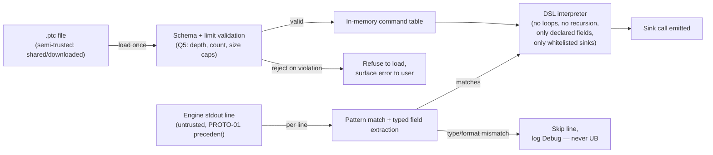

# Open Protocol Extension — diagrams

See [../user_story.md](../user_story.md) and [../planning.md](../planning.md).

## Component layering (where new pieces sit)

Notes:
- `highlight_cell`/`clear_highlights` (a `BoardRenderer` sink) were considered and dropped from the
  v1 sink whitelist 2026-09-06 — no `src/ui/board_*` file is touched by this feature.
- `EngineStatusView` needs one small addition (a dynamic label-pair row keyed by `.ptc`-chosen field
  name) since its 6 existing stat fields are fixed members, not a lookup-by-name container — see
  user_story.md's sink whitelist note (2026-09-06).

## Sequence — engine developer's command end to end

## Trust-boundary enforcement (load time vs. per-line)

