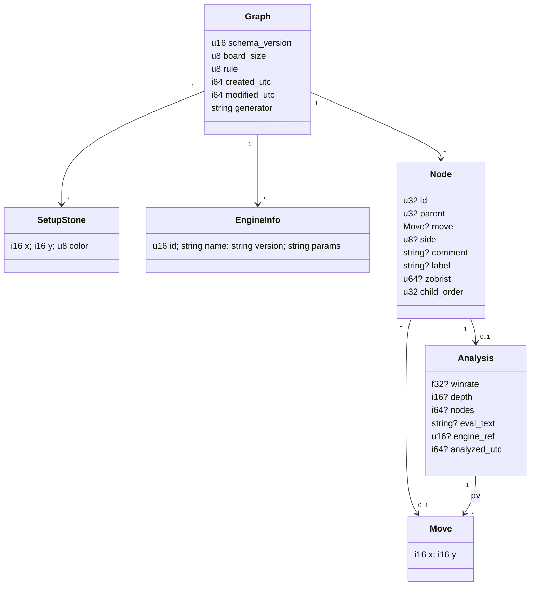
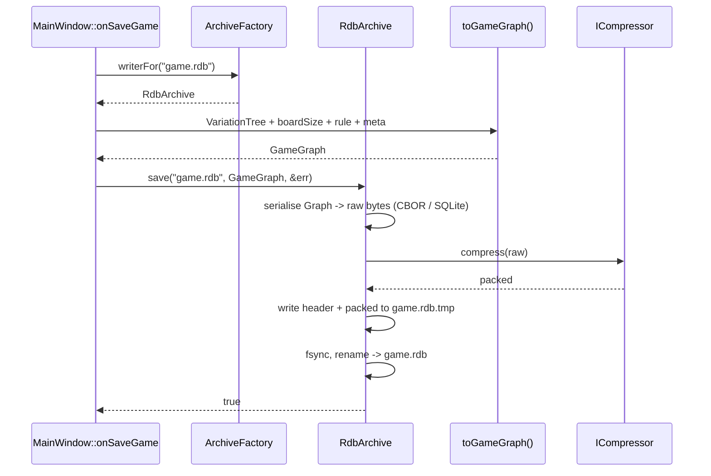

# `.rdb` container + schema + save/load flow

See [../user_story.md](../user_story.md) · [../planning.md](../planning.md).

## Container framing (little-endian)

| Offset | Size | Field | Notes |
|---|---|---|---|
| 0 | 4 | magic `"RDB1"` (`52 44 42 31`) | `file(1)` / sniff detection |
| 4 | 2 | `container_version` u16 | framing revisions only (rare) |
| 6 | 1 | `codec` u8 | 0 = none, 1 = zstd (reserved), 2 = deflate |
| 7 | 1 | `flags` u8 | bit0 = crc32 present |
| 8 | 8 | `payload_raw_size` u64 | decompress buffer hint + truncation check |
| 16 | 8 | `payload_packed_size` u64 | bytes of packed payload that follow |
| 24 | 4 | `crc32` u32 | of the packed payload; present iff `flags.bit0` |
| 24 or 28 | … | packed payload | `codec`-compressed serialised `Graph` |

## Payload — concrete CBOR encoding (Q2 resolved: CBOR + DEFLATE)

The payload, after DEFLATE inflation, is **one CBOR map** (`Graph`). Keys are
**short text strings** (not integers) — DEFLATE removes the repetition, and
string keys keep the format self-documenting and forward-tolerant: an unknown
key is skipped, there is no central key registry to collide on. Numbers use
CBOR's native encoding (canonical big-endian) — no manual byte order. `winrate`
is a CBOR float (float32 is enough for a probability).

The node tree is stored as a **flat array in DFS pre-order**, each node holding a
`parent` **index** back-reference (not nested children). Rationale: parse is a
single `for` loop with an O(1) bound check (`parent index < current index`), no
recursion depth limit on deep lines, and a future incremental writer can append.
Sibling order = array order; the first child encountered for a parent is its
**mainline**.

```
Graph = {                          ; CBOR map
  "schema":   1,                   ; uint  — payload schema version (NOT app version)
  "board":    15,                  ; uint  — board size, validated 5..MAX_BOARD_SIZE
  "rule":     0,                   ; uint  — GameRule: 0 Freestyle, 1 Standard, 2 Renju
  "created":  1725446400,          ; int   — unix seconds            (optional)
  "modified": 1725450000,          ; int                              (optional)
  "generator":"RANLS 0.2.0",       ; tstr                             (optional)
  "setup":    [ [x,y,color], ... ],; array — pre-placed stones, usually absent (optional)
  "engines":  [                    ; array — referenced by node analysis (optional)
     { "id":0, "name":"Rapfi", "version":"...", "params":"..." }
  ],
  "nodes":    [ Node, Node, ... ]  ; array — flat, DFS pre-order, nodes[0] = root sentinel
}

Node = {                           ; CBOR map
  "p": 0,                          ; uint  — parent index into nodes[]; ABSENT on nodes[0] (root)
  "m": [7, 7],                     ; [x,y] — the move; ABSENT on the root sentinel
  ; ---- everything below is optional ----
  "c": "White had to block here",  ; tstr  — move comment
  "g": "?!",                       ; tstr  — annotation glyph / label
  "z": 14063291837492,             ; uint64 — zobrist hint; ignorable, may be absent
  "a": {                           ; map   — analysis; ABSENT  => node never evaluated (=> NaN)
     "w":  0.534,                  ; float — winrate; ABSENT or outside [0,1] => treated as absent
     "d":  18,                     ; int   — search depth
     "n":  4211234,                ; int   — nodes searched
     "t":  "+0.53",               ; tstr  — engine eval text
     "pv": [[8,8],[7,9],[9,9]],    ; array of [x,y] — principal variation
     "e":  0,                      ; uint  — -> engines[].id
     "ts": 1725449000             ; int   — analysed-at unix seconds
  }
}
```

### Mapping to the current in-memory model

| CBOR | `TreeNode` field (src/model/variation_tree.h) | Notes |
|---|---|---|
| `m` | `move` (`Coord`) | `[x,y]` ⇒ `Coord{x,y}` |
| `a.w` | `eval` (`double`) | `a` absent ⇒ `eval` stays the NaN "unevaluated" sentinel |
| `a.d` | `depth` (`int`) | |
| `a.n` | `nodes` (`int64_t`) | |
| `c` | `comment` (`std::string`) | |
| `p` | tree position (rebuilt via `parent->addChild`) | not a stored field |
| `g`, `z`, `a.t`, `a.pv`, `a.e`, `a.ts` | **new** — `TreeNode` gains them (or a parallel `NodeAnalysis` struct) | RDB-01 / RDB-03 scope |

### Load algorithm

```
1. inflate payload; parse CBOR map.
2. validate: schema <= kSchemaVersion; board in [5, MAX_BOARD_SIZE]; rule in [0,2].
   any failure -> return nullopt + *error (current game untouched).
3. tnodes[0] = VariationTree::root().
4. for i in 1 .. nodes.len-1:
     n = nodes[i]
     if n.p is absent or n.p >= i         -> error (forward/self reference)
     parent = tnodes[n.p]
     child  = parent->addChild(Coord{n.m[0], n.m[1]})   ; array order => sibling order
     if n.a present:
        child->depth   = n.a.d ?? 0
        child->nodes   = n.a.n ?? 0
        child->eval    = (n.a.w in [0,1]) ? n.a.w : NaN
        child->comment = n.c ?? ""
        ... (pv, glyph, etc. into the new fields)
     tnodes[i] = child
5. GameState::invalidateEvalHistoryCache(); emit signal_tree_updated / signal_board_changed.
```

Note `evalHistory()` currently gates on `depth > 0 || nodes > 0` before trusting
`eval`. So a restored node needs its `depth`/`nodes` written too (not just `w`),
or that gate loosened to "eval is not NaN". RDB-03 decides — writing `d`/`n`
alongside `w` is the low-risk path.

## Legacy payload schema (logical view — superseded by the CBOR spec above)



- `nodes[0]` = sentinel root (`id=0`, `parent=0`, `move=null`).
- Child order among siblings = `child_order` (0 = mainline). Reader rebuilds
  `TreeNode.children` in that order.
- `Analysis` absent ⇒ node was never evaluated ⇒ `evalHistory()` yields NaN.
- `winrate` absent, or outside `[0,1]` on load ⇒ treated as absent (never `0.5`).

## Save



## Load

```mermaid
sequenceDiagram
    participant UI as MainWindow::onLoadGame
    participant F as ArchiveFactory
    participant A as ArchiveReader
    participant C as ICompressor
    participant P as applyGameGraph()
    participant GS as GameState
    UI->>F: readerFor("game.rdb")  %% or .yxgame -> YxgameReader
    F-->>UI: RdbArchive
    UI->>A: load("game.rdb", &err)
    A->>A: read + validate magic / container_version
    A->>A: read sizes; bounds-check
    A->>C: decompress(packed, raw_size_hint)
    C-->>A: raw
    A->>A: parse Graph; validate board_size / rule / winrate ranges
    alt any problem
        A-->>UI: nullopt + err
    else ok
        A-->>UI: GameGraph
        UI->>GS: newGame(boardSize); setRule(rule)
        UI->>P: applyGameGraph(GameGraph, GameState)
        P->>GS: rebuild VariationTree (moves, evals, comments)
        P->>GS: invalidateEvalHistoryCache()
        GS-->>UI: signal_tree_updated / signal_board_changed
    end
```

## Backward / forward compatibility

| Case | Behaviour |
|---|---|
| Old build opens new `.rdb` (higher `schema_version`, extra fields) | unknown fields skipped; known fields load; if `container_version` unknown ⇒ clean refusal with message |
| New build opens old `.rdb` (missing fields) | missing optional fields ⇒ defaults; missing `Analysis` ⇒ NaN |
| Any build opens `.yxgame` | `YxgameReader` → moves + rule + board size; all nodes NaN |
| New build opens a truncated / corrupt `.rdb` | size mismatch or crc fail ⇒ `nullopt` + error, no crash, current game untouched |
