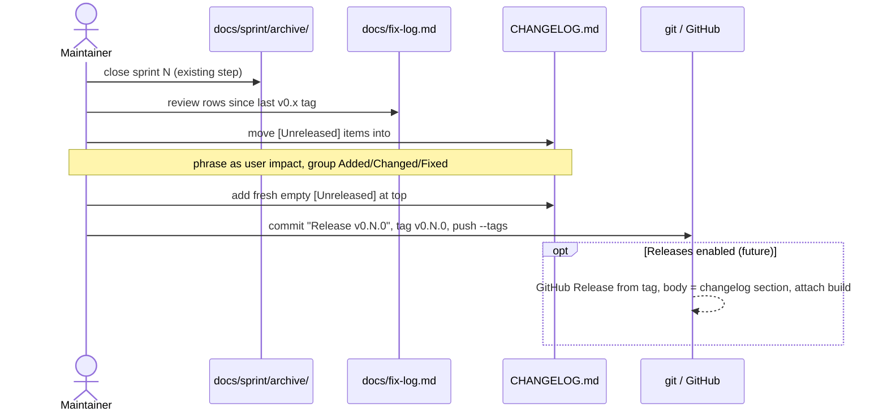
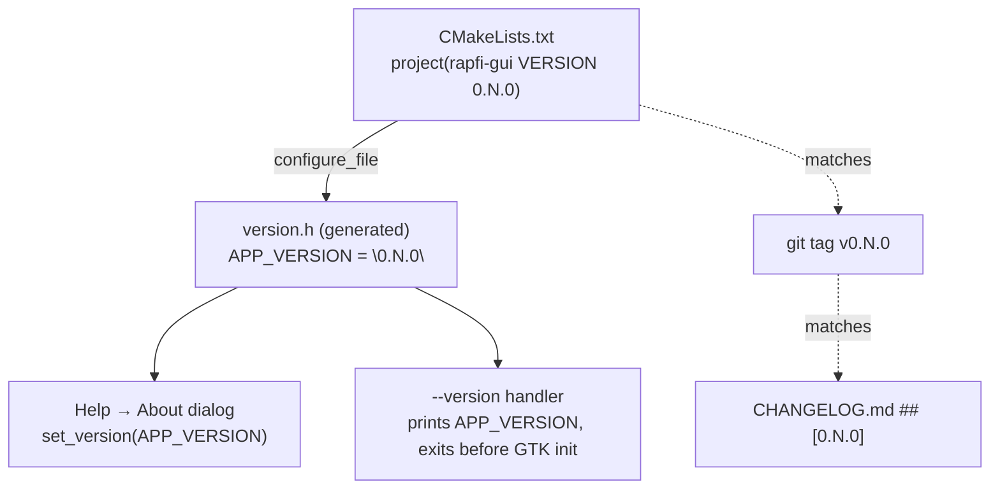
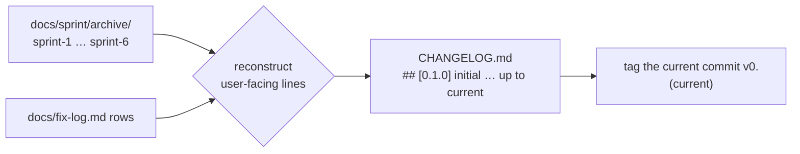

# Diagrams — versioning + changelog

See [../user_story.md](../user_story.md) and [../planning.md](../planning.md).

## Release cut at sprint close (sequence)

## Version string — one source, many readers

## Backfill (one-time)

